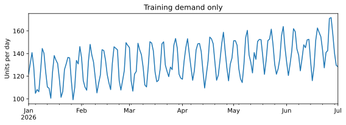
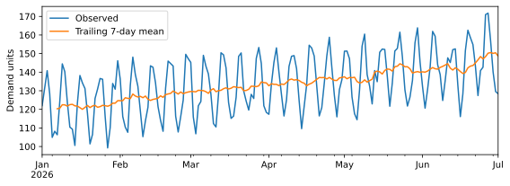
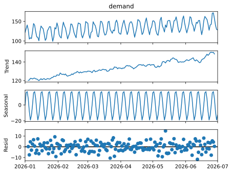
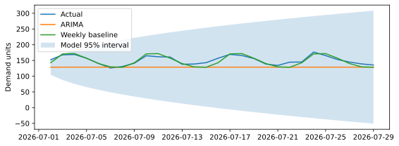

# Saved charts

Generated from the executed worked examples. Use the worked notebook and answer key to interpret them.

## worked-cell-1-figure-1

## worked-cell-2-figure-1

## worked-cell-3-figure-1

## worked-cell-3-figure-2

