# Make the next decision better

## Advanced Data Analysis - participant handbook

Practical Python workshop for experienced analysts. English with Arabic interpretation.

[Download the illustrated PDF](../dist/participant-handbook.pdf). The earlier detailed handbook is retained as [technical reference](HANDBOOK_TECHNICAL_REFERENCE.md).

## You already know more than you think

*WELCOME*

You probably know the moment: the code runs, a chart appears, and someone asks, “So what should we do?” That last step is what this week is about.

We will build on the Python and analytical work you already do. You will run prepared notebooks, change selected settings, compare results and explain what those results mean. You will not be asked to develop an application from scratch.

Work with a partner. One person operates; the other checks the assumptions and asks questions. Swap at a useful checkpoint. Two pairs form a group for reporting. Everyone keeps their own notes and completes the final exercise individually.

You do not need to defend your first answer. Changing your mind when the evidence changes is part of good analysis.

> Before we start: What analysis do you do now? Who uses it? What decision would you like it to improve?

Your notes: __________________________________________________

## A workshop, not a tour of software

*OUR WEEK*

Every day includes discussion, two substantial practical sessions and time to develop your proposal. Day 5 brings the work together.

The five-hour day includes two fifteen-minute breaks. Explanations and reporting allow time for interpretation. When someone is speaking or interpreting, give them the room; there will be time to test the code afterwards.

The core route uses the existing Python notebooks. If a laptop fails, use the saved results and keep working on the same analytical question. The paper-only workbook is a backup, not a lower standard of reasoning.

| Day | The question | What you take away |
| --- | --- | --- |
| 1 | Can we trust this report? | A defensible audit and chart |
| 2 | Is the prediction useful? | A baseline and error-cost argument |
| 3 | What could we know at the time? | A forecast and text evaluation design |
| 4 | Can we act under uncertainty? | A probability-based recommendation |
| 5 | What would a pilot need? | A practical proposal with an owner |

> Your contribution can be a useful calculation, a good question or a well-supported disagreement.

## What can we learn from practice in Spain?

*A WORKING METHOD, WITH LOCAL REFERENCE POINTS*

There is no single way that every Spanish or European team works. Two documented reference points are helpful: Spain's INE describes its commitment to a European statistical quality framework; datos.gob.es publishes guidance on documenting and improving open data. See the reference page for the original sources.

Our workshop translates that quality emphasis into a proposed team routine. Agree what a measure means. Make the analysis repeatable. Let a colleague challenge the result. Explain what remains uncertain. Record who will act and what evidence would change the decision.

For a public-service team, a useful case might concern appointment capacity, facilities maintenance, processing times or routing service requests. Start with a generalised problem; we do not need operational records to discuss its design.

The numerical classroom datasets are synthetic. The Spanish sources are examples of documented practice, not the source of our teaching data.

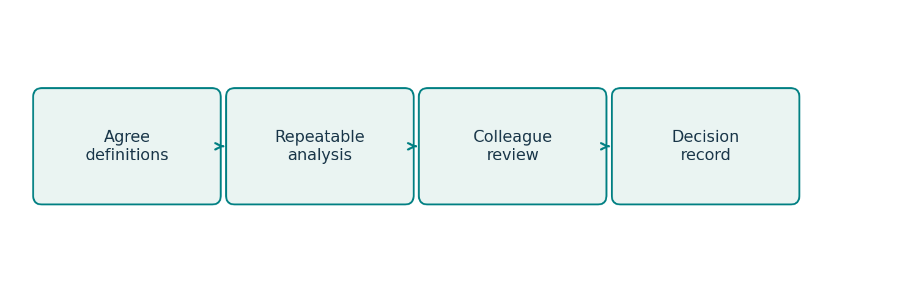

Proposed workshop routine. Adapt the ownership and review stages to your organisation.

> Discuss: Which step already works well in your team? Which step is often rushed?

## Before we trust the dashboard

*DAY 1 | READ THE DATA BEFORE THE STORY*

A service manager sees one office taking longer than another and asks whether to move staff. A sensible first response is a question: are the offices handling comparable cases? Are unfinished cases missing? Has the reporting definition changed?

The same habits apply to today's retail teaching table. Before changing a row, inspect the types, units, missing values and duplicates. Then write a rule you could explain to a colleague.

A missing price is not a zero price. A repeated record is not always an error. An unusual order is not automatically a mistake. Our teaching rules identify two accidental duplicates and one invalid negative sales quantity. The confirmed 80-unit bulk order remains valid.

Keep a short decision log: issue, action, reason and affected count. It is easier to write it while you work than to reconstruct it before a meeting.

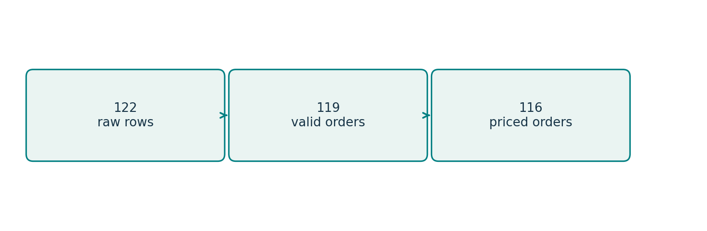

The original notebook's audit trail: 122 raw rows → 119 valid orders → 116 priced orders.

> Ask your partner: Which cleaning rule depends on knowing what the business process means?

## A total is only one view

*DAY 1 | CHOOSE THE DENOMINATOR*

The cleaned example has EUR 10,210 in known revenue. Store contributes EUR 6,310, Online EUR 3,700 and Unknown EUR 200. Three valid orders have missing prices, so this is not a complete total for all valid orders.

Store has 60 priced orders and Online has 54. Mean known revenue per priced order is about EUR 105.17 and EUR 68.52 respectively. A total and a mean answer different questions.

A large order can pull up the mean. The median helps describe a typical middle observation; the spread tells you how variable the experience is. For capacity planning, unusually long or large cases may matter even when they are rare.

None of these summaries proves that changing a channel would cause revenue to change. That would require additional evidence and a suitable design.

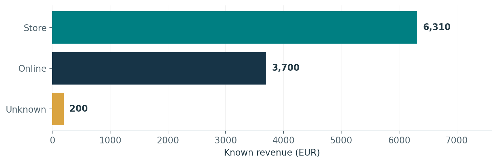

Synthetic notebook data. Revenue excludes three unpriced orders; Unknown retains missing channel values.

> Finish this sentence: “Store has more known revenue in this sample, but…”

## Give the chart a fair chance

*DAY 1 | MAKE ONE POINT CLEARLY*

Choose the picture after the question. Use a bar chart to compare categories, a line to show time, a histogram to show a distribution and a scatterplot to explore two numerical quantities.

For bars, start the value axis at zero so the lengths represent the quantities fairly. Label the units. Name the period and population. Use colour to direct attention, not to decorate every category differently.

A useful title might be “Store accounts for more known revenue in this synthetic sample.” “Store is best” is harder to defend: best for revenue, margin, workload or something else?

Run a sensitivity check without the valid bulk order, but label it clearly and keep the main result with that order included. The alternative view tells you how much the conclusion depends on one observation; it does not turn a valid observation into an error.

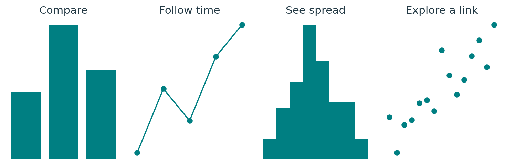

Four starting points: categories, time, distribution and relationship. These are schematic examples.

> Sketch a chart you currently use at work. What is its question? What would you remove or label more clearly?

Your notes: __________________________________________________

## Your first working session

*DAY 1 | PYTHON LABS AND A SHORT BRIEFING*

Open day-01-eda/student.ipynb. Use the worked notebook when you need a syntax reminder; explain the operation you borrow.

Lab A · 40 minutes. Audit the table before editing. Record the raw count, duplicates, missing fields and invalid quantities. Agree your cleaning rules and justify them.

Lab B · 45 minutes. Apply the rules, calculate revenue and create one labelled chart. Compare mean and median. Run a clearly labelled sensitivity check for the bulk order.

Lab C · 50 minutes. In your reporting group, write a briefing and let another pair challenge it. Then choose your capstone decision and owner.

Stretch if you finish early: identify a plausible way the ranking could change without any calculation being wrong. Explain what extra information would settle it.

| Record your evidence | Your result |
| --- | --- |
| Raw / valid / priced rows |  |
| Known revenue and exclusions |  |
| Main finding |  |
| Limitation that changes the decision |  |

> Exit note: Name one data-cleaning decision you would now document more carefully.

## Is the model useful, or just impressive?

*DAY 2 | START WITH THE DECISION TIME*

Think about a team planning visits before dispatch. Predicting the duration is a regression problem. Flagging a likely delay is classification. Grouping similar workloads without an outcome label is clustering.

The method follows the question. First write the decision, who makes it and when. Then list what information genuinely exists at that time.

Today's synthetic routes use planned distance and stops as inputs. Actual arrival time and later complaints would arrive too late for a pre-dispatch prediction. Including them would make the evaluation unrealistically easy.

The notebook develops the procedure on 300 routes and holds out 100. Its independent synthetic observations support a random split. A real future-service prediction may need a chronological split and checks for repeated entities.

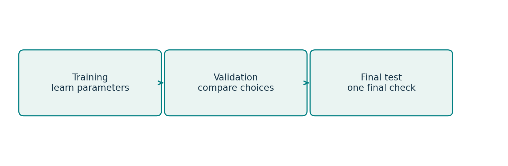

Training and validation support development. The final test checks the procedure after choices are fixed.

> For your own problem, write one useful input and one tempting input that would arrive too late.

## The baseline earns its seat

*DAY 2 | ERROR IN UNITS PEOPLE UNDERSTAND*

A baseline is a simple reference: perhaps a training average, the last observed value or an existing operational rule. The model should justify its extra complexity against that alternative.

Mean absolute error is the average size of the error in the target's units. If absolute errors are 5, 10 and 15 minutes, MAE is 10 minutes. That does not promise that each prediction is within ten minutes.

The saved route example has MAE 24.34 minutes for the baseline and 8.43 for the model. It is a useful result on this synthetic test. You would still want representative data, error distributions and an understanding of the operational cost before deployment.

Keep preprocessing inside the fitted pipeline. In validation, the imputer should learn only from the training portion, not from held-out observations.

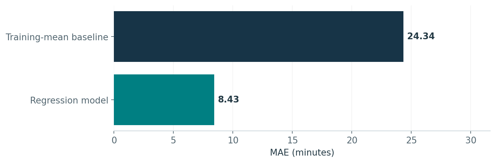

Recorded synthetic route results. Lower MAE is better; the chart does not establish real-service performance.

> Explain the improvement in two sentences without using “the model is accurate”.

## Which mistake hurts more?

*DAY 2 | READ THE COUNTS BEFORE THE PERCENTAGES*

Rows show actual status; columns show predicted status. There are 43 actual delays and 36 predicted delays. Recall is 34/43, about 79.1%. Precision is 34/36, about 94.4%. Accuracy is 89%.

Now give the errors a fictional cost: 100 units per missed delay and 20 per false alarm. The model costs 940 units; predicting every route on time costs 4,300. If a missed delay costs only 1, the comparison reverses: 49 against 43.

This is an error-cost exercise, not a measured return on investment. Costs, intervention effects and the decision threshold need agreement. Choose a threshold using development data, then evaluate on a fresh final test.

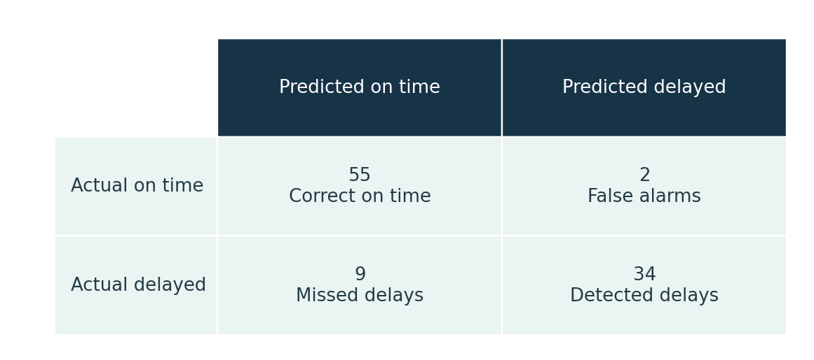

Original classifier test: 100 synthetic routes. TN 55, FP 2, FN 9, TP 34.

> A manager asks for “the highest accuracy”. What would you ask before choosing?

## Run, compare, then explain

*DAY 2 | GUIDED EXPERIMENTS*

Open day-02-machine-learning/student.ipynb. The examples run before the pair challenges; use them as a starting point.

Lab A · 40 minutes. Reproduce the regression and baseline results. Explain MAE in minutes and audit the input features for decision-time availability.

Lab B · 45 minutes. Inspect candidate selection using validation results. Read the final confusion matrix and compare the supplied error costs. Do not tune against the final test.

Lab C · 50 minutes. Compare tree depths 1, 3 and 8 on training folds only. Record training accuracy and validation F1, recognising they are different measures. Join the guided clustering/PCA discussion and add the method, target and baseline to your capstone.

A tree makes successive decisions; a forest combines randomised trees. Neither family always wins. Clusters need stability and a useful interpretation. PCA retains variation, not necessarily business relevance.

> Stretch: design a split for repeated visits to the same sites over several months. What overlap would make the result too optimistic?

Your notes: __________________________________________________

## The future arrives one day at a time

*DAY 3 | FORECAST WHAT COULD HAVE BEEN KNOWN*

A staffing forecast needs a deadline as well as a horizon. A good prediction that arrives after the scheduling meeting is not a useful service.

Check dates, frequency, missing periods and the working calendar. A missing daily record might mean no demand, a closure or a collection failure. Do not silently turn all three into zero.

Trend describes a sustained direction. Seasonality repeats at a known interval. Cycles need not have a fixed period. The seven-day pattern in this course is synthetic; a real service needs its own calendar and evidence.

The notebook holds out the last 28 of 210 days. The weekly baseline repeats the latest seven values. The fixed ARIMA(1,1,1) example does not explicitly model the weekly pattern, so a simple seasonal rule can win.

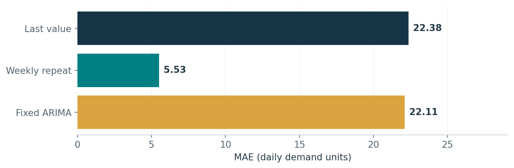

Recorded final-holdout MAE: weekly 5.53; last value 22.38; fixed ARIMA 22.11. Lower is better.

> A simpler model winning is a finding, not an embarrassment.

## One good window is not enough

*DAY 3 | DESIGN THE EVALUATION*

Choose model settings using development data. Keep the final window for the final claim. If you repeatedly alter the model after seeing that window, it becomes part of development.

Rolling-origin evaluation asks the same practical question at several historical cutoffs: using only the information available then, what could we have forecast next?

For each origin, refit the relevant preprocessing and model using the past, evaluate the next window and record the errors. Look at when performance changes, not only an overall mean.

Today the notebook challenge uses the last fourteen training days as a validation window. The diagram below explains a broader rolling design; it is not a claim that the original notebook executes the full backtest automatically.

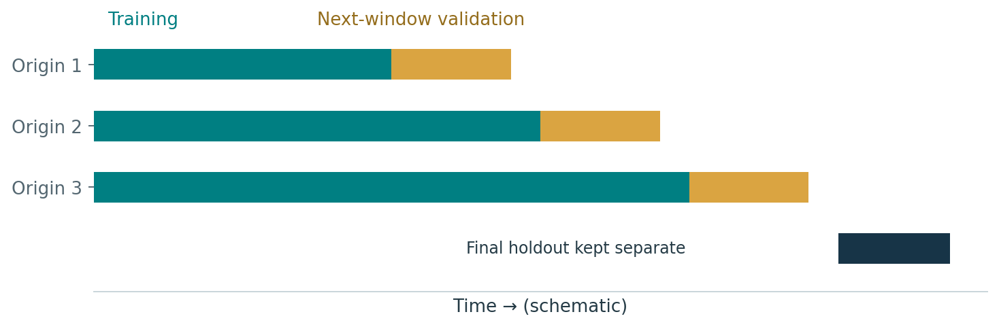

Schematic expanding-window evaluation. Preserve a separate final holdout after development choices.

> Sketch the first date your model may train on and the last date it may see before each prediction.

Your notes: __________________________________________________

## A sentence can contain two problems

*DAY 3 | TEXT, LANGUAGE AND HUMAN REVIEW*

“The delivery was late and I was charged twice.” A single-label classifier may have to choose, but the person has raised two issues. Sometimes the task definition needs attention before the algorithm does.

The notebook turns authored English messages into TF-IDF features and uses a classifier for delivery or billing. The vectoriser belongs inside the fitted pipeline. These categories are not sentiment labels.

Getting eight easy authored test messages right tells us about those eight cases. It does not validate real complaints, Arabic, dialects, mixed-language messages or rare categories. Interpreter support in class does not change that limitation.

Embeddings and language models offer other representations and capabilities, but they still need representative evaluation, a clear task and an escalation rule.

| Message | Your handling rule |
| --- | --- |
| “It arrived late and I was charged twice.” |  |
| “Great service. Still waiting.” |  |
| “Please call me about yesterday.” |  |

> When is it better to ask for clarification or route to a person than to force a label?

## Connect the message to the calendar

*DAY 3 | LABS AND THE TEXT–TIME BRIDGE*

Open day-03-time-series-nlp/student.ipynb.

Lab A · 40 minutes. Compare the three predeclared forecast errors. Explain the time boundary and reserve training-only data for experiments.

Lab B · 45 minutes. Run the text pipeline, inspect its test messages and write two ambiguous examples. Record what the output misses and when human review is needed.

Lab C · 50 minutes. Compare last-value and weekly forecasts on the fourteen-day development window. Then discuss the separate teaching counts below and update the capstone's evaluation split.

Wednesday's completed counts cannot be an input to a forecast issued Wednesday morning. Tuesday's counts can only be used if they were available before the cutoff. A change in the classifier may change category counts without changing the underlying workload.

| Day | Billing | Delivery | Uncertain |
| --- | --- | --- | --- |
| Monday | 2 | 3 | 1 |
| Tuesday | 1 | 5 | 2 |
| Wednesday | 3 | 4 | 1 |

> Exit: What further evidence would you request after a model gets eight out of eight examples right?

Your notes: __________________________________________________

## Can we act without knowing the exact rate?

*DAY 4 | MAKE UNCERTAINTY VISIBLE*

Eight defects in one hundred inspected items gives an observed rate of 8%. The underlying process rate is still uncertain. A Bayesian model makes that uncertainty explicit.

The prior describes uncertainty before these observations. The likelihood describes how compatible the observations are with candidate values. The posterior updates the uncertainty using both.

Our prior is Beta(2,18), with mean 10%. Eight defects and ninety-two non-defects give Beta(10,110), with posterior mean about 8.33%. The prior parameters are modelling choices, not necessarily twenty actual inspections.

The result assumes a suitable sample of comparable items and a sufficiently stable process. Larger samples do not repair a systematically unrepresentative inspection process.

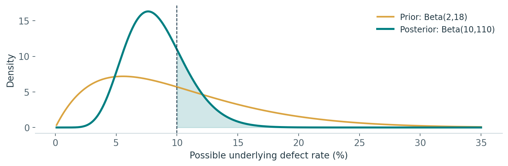

Exact Beta prior and posterior for the synthetic inspection case. Curves are densities, not counts of defects.

> What would make one common defect rate an unreasonable description of the process?

## A probability does not choose the policy

*DAY 4 | SEPARATE THE CALCULATION FROM THE ACTION*

The posterior credible interval for the rate is about 4.1%–13.9%. It contains 95% of posterior probability under this model and prior. It is not a guarantee, and it is not the interval for a future defect count.

The posterior probability that the underlying rate exceeds 10% is about 23.75%. A fictional policy that triggers extra inspection above 20% would lead us to act; a 30% trigger would not. Those thresholds are teaching assumptions, not industry requirements.

Compare a different prior and a larger sample in the notebook. Ask which conclusions move and why. Report the assumptions alongside the recommendation rather than hiding them in a technical appendix.

| Question | The right summary |
| --- | --- |
| What is the unknown underlying rate? | Posterior distribution / credible interval |
| Could the rate exceed a concern threshold? | Posterior tail probability |
| How many defects might be in the next batch? | Posterior predictive distribution |
| What should we do? | Probability + consequences + agreed policy |

> Write three separate sentences: the probability, the policy assumption and the action.

Your notes: __________________________________________________

## A convincing simulation still needs checking

*DAY 4 | MCMC AND GENERATED DATA*

The exact posterior is available here. We use a Metropolis sampler to understand an approximation while keeping a known answer for comparison.

Propose a nearby rate, compare posterior density, then accept or stay. Repeated states are legitimate. Inspect several chains, their movement and autocorrelation. Similar means alone do not prove adequate exploration.

For a future batch, draw a possible rate from the posterior and then a count conditional on that rate. The saved simulation gives about 8.32 defects on average, with a central 95% predictive interval of roughly 2–17 in a batch of 100.

The duration example generates positive values from a fitted lognormal model. Compare centre, spread and tails. Matching a mean does not prove realism, preserve every relationship or establish privacy.

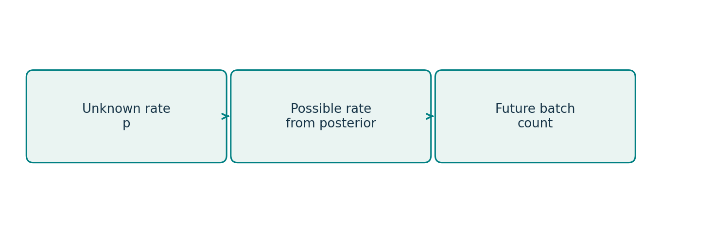

Two different questions: uncertainty about a rate, and variability in a future batch count.

> Ask of generated data: fit for which use, checked against which reference, and missing which cases?

## Try a different assumption

*DAY 4 | LABS THAT CHANGE THE QUESTION*

Open day-04-bayesian-generative/student.ipynb.

Lab A · 40 minutes. Run the exact update. Compare Beta(1,1) with the original prior using the same observations. Then inspect sixteen defects in two hundred with the original prior. Compare posterior means and interval widths.

Lab B · 45 minutes. Run or inspect the four-chain sampler. Compare with the exact distribution. Explain what the trace and autocorrelation tell you. The tiny-proposal experiment is an extension, not a mandatory coding test.

Lab C · 50 minutes. Compare the future-count distribution with the rate's posterior. Inspect generated durations. Add uncertainty, an action rule and the responsible owner to your capstone.

Keep the units visible. A probability of exceeding a rate threshold is not an expected number of defects.

> Exit: explain the difference between uncertainty about the rate and variation in tomorrow's batch.

Your notes: __________________________________________________

## Choose infrastructure for the actual constraint

*DAY 5 | SCALE IS A QUESTION TO INVESTIGATE*

Start with the bottleneck: memory, processing time, arrival rate, reliability or something else. A task that fits comfortably on one machine may not benefit from a distributed system. Measure before choosing.

Partitioning lets separate workers process slices of data. Partial sums and counts can be combined. Means need their denominators: combine total sums and counts before dividing.

HDFS stores distributed data; YARN manages resources; MapReduce is a processing framework in the Hadoop ecosystem. Spark is a separate processing engine that can work with Hadoop infrastructure.

In Spark, transformations describe work and actions request results. Grouping can require a shuffle. Collect brings rows back into driver memory; two aggregate rows are a very different proposition from a huge raw table.

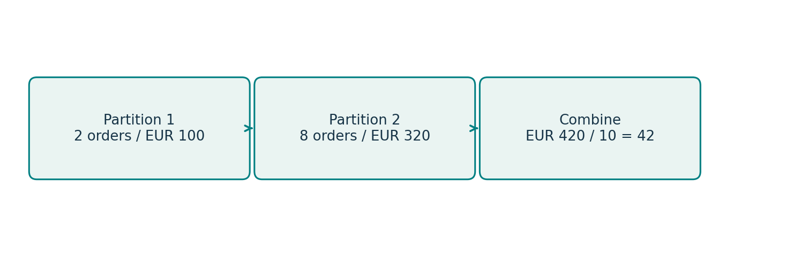

Separate hand example: A has 10 orders and EUR 420 total, so its overall mean is EUR 42, not EUR 45.

> What measurements would convince you that your current tool is no longer sufficient?

## More advanced does not mean more useful

*DAY 5 | COMPARE LIKE WITH LIKE*

The saved Spark regression has MAE 2.248 against a baseline of 20.227 on its synthetic task. The separate neural classification example has accuracy 0.847 against 0.827 for a linear classifier. These measures are for different tasks; they do not belong in one league table.

A neural network learns layered transformations. A fixed architecture still needs representative evaluation, comparison with a simpler method and a maintenance plan. Training loss is not held-out accuracy.

Our toy adversarial generator learns alongside a discriminator. It targets a distribution with mean 2 and standard deviation 0.6. The recorded generated mean is about 2.10, but standard deviation is only about 0.287. A similar mean can hide a serious lack of spread.

This is a one-dimensional teaching model, not an image generator or a validated method for creating realistic service records.

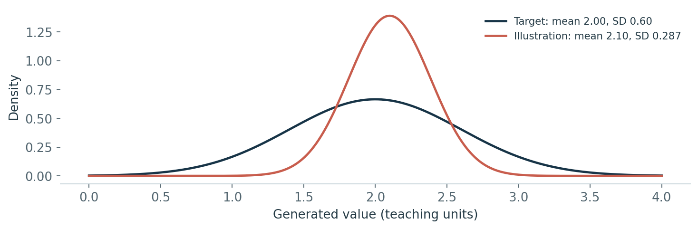

Illustrative normal curves using the target and recorded summary parameters; not empirical sample histograms.

> If you could report only the mean, what important failure would your audience miss?

## A pilot is a working agreement

*DAY 5 | THE MODEL NEEDS AN OWNER*

A model becomes useful inside a process. Someone must know when the input is ready, what to do with the result and when to ignore it. Someone must also own the response when it fails.

Define a representative evaluation and a baseline. Specify which errors matter, including performance on relevant groups or service conditions. Agree review frequency, a measurable stop rule and a return to the existing process.

Lab A · 40 minutes. Run the Spark SQL and DataFrame aggregation if the environment is ready; otherwise use the offline activity. Reconcile the results and explain the memory implications.

Lab B · 45 minutes. Compare the MLlib result with its baseline, inspect the neural/GAN evidence and draft a monitored pilot. Keep optional training short enough to leave time for the decision.

| Pilot detail | Your agreement |
| --- | --- |
| Decision and operational owner |  |
| Baseline and evaluation window |  |
| Error measure and review frequency |  |
| Stop condition, action and owner |  |
| Human review / return to current process |  |

## The director has three minutes

*YOUR CAPSTONE | ONE PAGE THAT CAN TRAVEL*

Choose a generalised problem from your work or a supplied scenario: appointment demand, facilities visits, service-request routing, quality inspection or workload grouping. Do not include confidential records.

Use six headings: decision, method, data, evaluation, limitation and next step. Write enough for another person to understand what is proposed and what is not yet known.

On Day 5, use fifteen minutes to finish the page. Five groups then have seven minutes each: three speaking, three interpretation and one feedback. Each person keeps an individual page even if the group presents one shared scenario.

Avoid “collect better data” as a next step. Say who will request which definition, sample or permission, from whom and by when.

| By the end of… | Add to your proposal |
| --- | --- |
| Day 1 | Decision, owner and data-quality concern |
| Day 2 | Method, target, baseline and error costs |
| Day 3 | Time boundary and evaluation split |
| Day 4 | Uncertainty, action threshold and assumptions |
| Day 5 | Pilot owner, monitoring and next step |

> A useful proposal can be modest. It needs to be specific.

## Say what you know, then what you would do

*A BRIEFING YOU CAN USE AFTER THE COURSE*

Finding. Give one clear result in ordinary language, with a number when it helps.

Evidence. Say which data and comparison support it. Name the baseline and evaluation where relevant.

Limitation. Name a boundary that could affect the decision. “More research is needed” is usually too vague.

Next step. Give an action, an owner and a time or trigger.

What would change my mind. Name evidence that would make you revise the recommendation.

For example: “The weekly baseline had lower error than the fixed ARIMA example on our synthetic holdout. That does not establish performance across real peak periods. I would ask the planning analyst to run several past-to-future evaluations before the next scheduling review. I would reconsider if a validated alternative improved performance in the periods that matter operationally.”

> Now write your own five-line briefing. Use a real decision, but no confidential details.

Your notes: __________________________________________________

## A final check on your judgement

*INDIVIDUAL EXERCISE | 20 MINUTES*

A service team wants to predict tomorrow's delayed visits. A vendor reports 96% accuracy; predicting every visit on time scores 95%.

1. Name the method, the decision and one feature available at scheduling time.

2. Propose a split and baseline. What additional evidence would you request?

3. Correct these claims: “96% proves usefulness”; “synthetic guarantees privacy”; “running Spark locally proves scale.”

4. Recommend one next step, an owner and a measurable stop condition.

Use five minutes for translated instructions and fifteen for your individual written answer. This is formative feedback on analytical judgement. It is not certification that you can independently build every system discussed.

Your notes: __________________________________________________

## Take the habits back to work

*YOUR NEXT TWO WEEKS*

Choose one analysis already on your desk. You do not need a new platform to improve it.

First, clarify its decision and definition. Next, add a baseline or a better comparison. Ask a colleague to challenge the assumptions. Then rewrite the conclusion so a decision-maker can see the evidence, the limitation and the next step.

If you plan a new model, start with a small, representative evaluation and an agreed owner. Keep a record of the data version, code, parameters and decisions. A result should be explainable and repeatable after the person who created it has left the meeting.

Use the course's post-course pack for a longer follow-up plan, the method card as a quick reference and the notebooks as examples to adapt carefully.

| Your commitment | Write it down |
| --- | --- |
| One analysis I will improve |  |
| One colleague I will involve |  |
| One assumption I will check |  |
| Action and date |  |

> The aim is not to use every technique. It is to choose well and make the next decision better.

## Where to find things

*FILES, SOURCES AND HONEST LIMITS*

Core Python work: the student and worked notebooks in day-01-eda through day-05-big-data. Each day has task cards, an answer key and technical explanations. Day 5 also has spark_worked.ipynb and an offline activity.

Tutor: instructor/TUTOR_SCRIPT.md is the full speaking document. The QUESTION_BANK and daily TEACHING_GUIDE files remain preparation references. The paper-only workbook is available if a device or environment fails.

This handbook's diagrams are original teaching illustrations. Numerical charts use recorded synthetic course results; the prior/posterior curve is calculated from the stated Beta distributions. The GAN curves illustrate recorded summary parameters rather than empirical samples. No real ministry dataset is included.

The technical reference preserves the earlier handbook's more detailed explanations. The English–Arabic glossary remains a draft for interpreter validation. For formal policies or legal questions, consult the appropriate current organisational source.

> Sources checked 21 September 2026. The workshop routine is a teaching proposal, not a claim that all Spanish or European organisations work identically.

- [INE | Quality framework](https://www.ine.es/dyngs/MYP/es/index.htm?cid=35)

- [datos.gob.es | Practical guide to open-data quality](https://datos.gob.es/es/documentacion/guia-practica-para-la-mejora-de-la-calidad-de-datos-abiertos)

- [Course repository](https://github.com/gabiarno/advanced-data-analysis-course)
